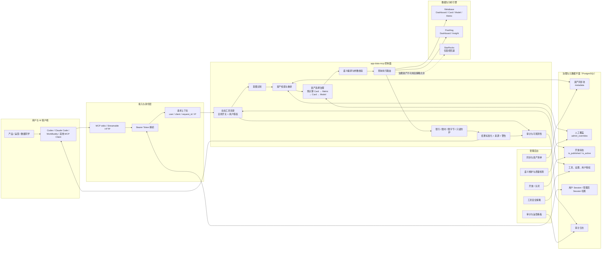
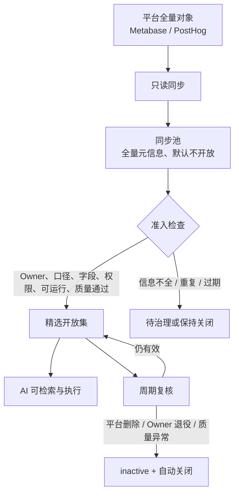
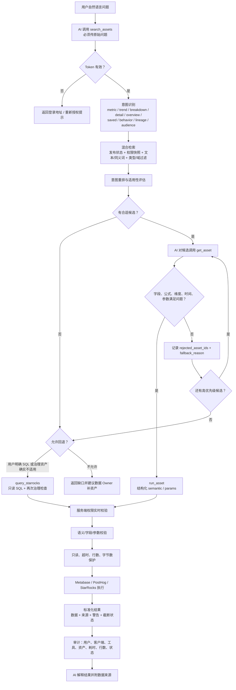
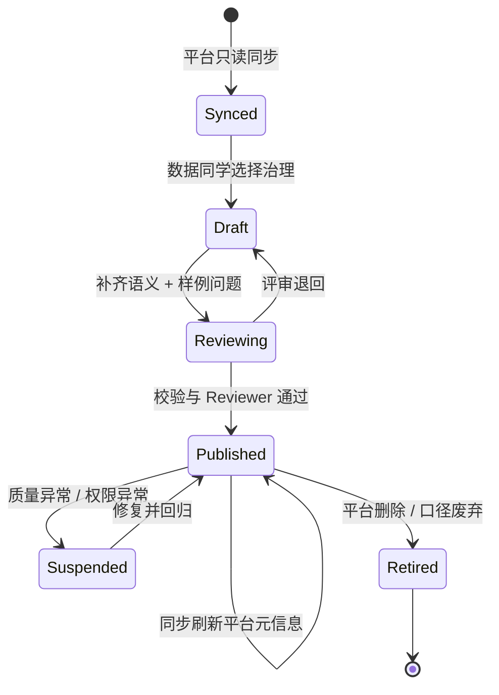
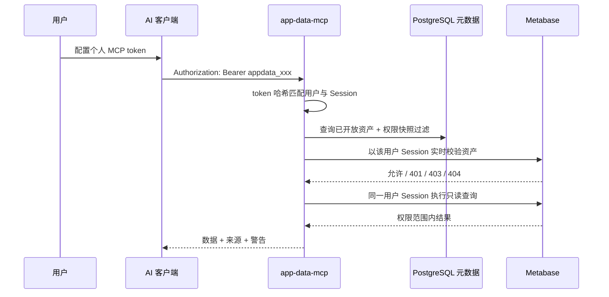
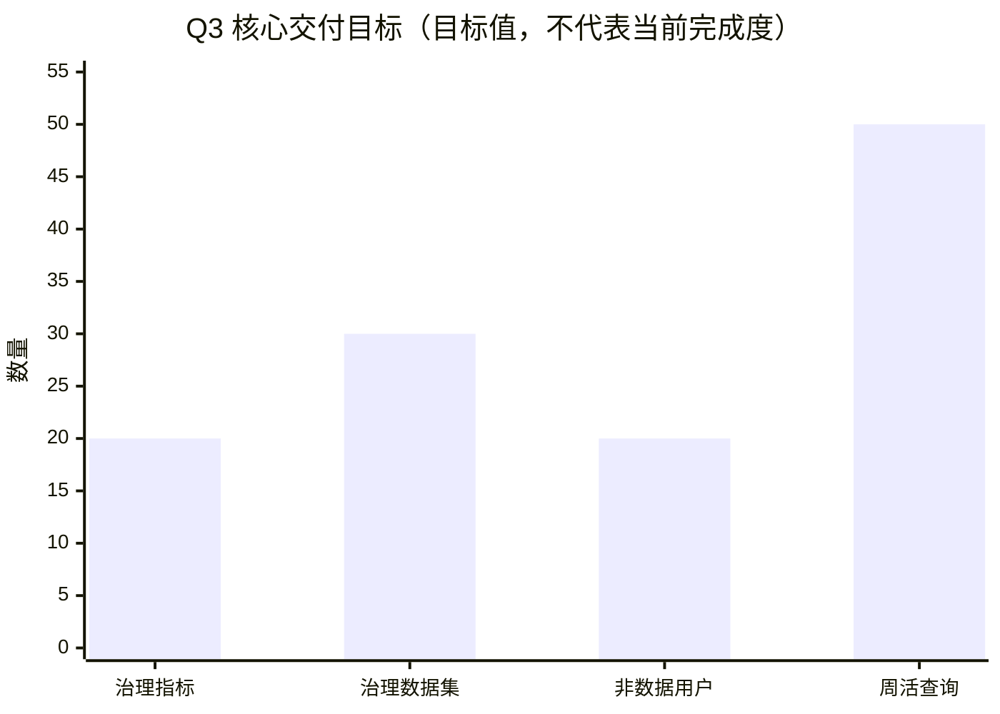
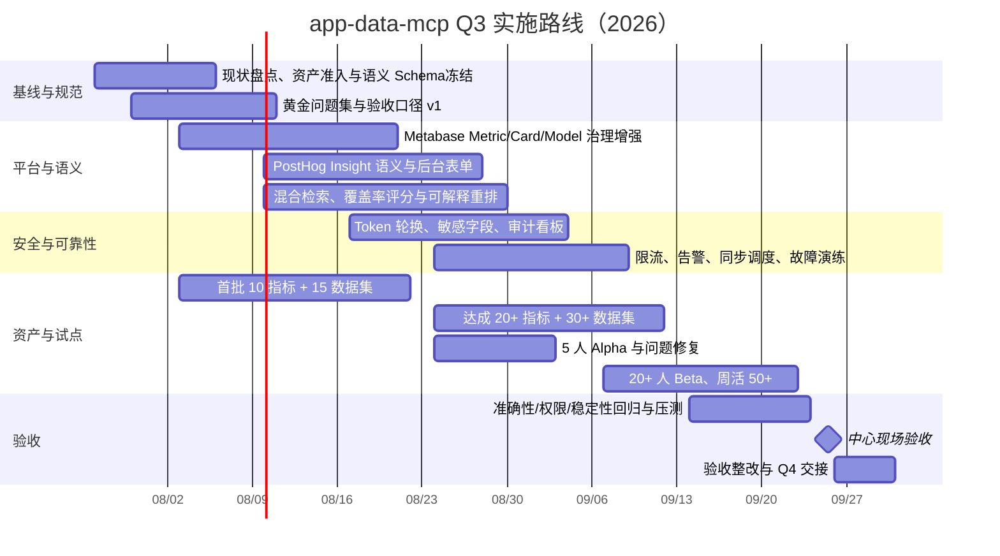

# app-data-mcp 技术实现方案（Q3）

**版本：** V1.0（讨论稿）  
**日期：** 2026-07-24  
**面向对象：** 数据、后端、产品、运营、信息安全与管理层  
**目标：** 将日常数据查询从“找数据同学取数”逐步转为“在权限边界内由 AI 自助查询”，并在 9 月底完成中心现场验收。

> 核心判断：app-data-mcp 不应成为另一个 BI，也不应允许 AI 任意生成 SQL。它的定位是位于 AI 工具与 BI/数据引擎之间的“只读数据控制面”：用精选资产、结构化语义、个人权限、执行护栏和审计闭环，把自然语言问题稳定转换成可解释、可追溯、可控制的数据查询。

## 1. 方案摘要

Q3 建设采用“同步池 + 精选开放集 + 语义层 + 受控执行”的四层路线。

1. **同步池**只读同步 Metabase、PostHog 元信息，完整保存平台对象及权限快照，但新资产默认不开放。
2. **精选开放集**由数据同学按业务需求维护，Q3 至少治理并开放 20 个核心指标、30 个可分析数据集/表级资产。
3. **语义层**统一描述指标口径、同义词、维度、时间口径、粒度、Rollup、累计、血缘、负责人和使用限制，使 AI 能检索并正确调用。
4. **受控执行**坚持正式指标从 Metric/Card 查询：安全且新鲜的预计算 Card 优先，Metric 负责权威重算；Model 主要查询明细，SQL 最后回退。查询使用个人 MCP token 对应的 Metabase 权限，所有工具只读、有限流、有限行、有限响应并全程审计。

Q3 的成功不是“接入了多少原始资产”，而是以下闭环同时成立：

- 普通产品/运营用户能够从 Codex、Claude Code、WorkBuddy 等 AI 入口自然语言提问；
- 常见日活、周趋势、分组、固定报表、漏斗/留存查询在 1 分钟内返回结果和数据出处；
- 至少 20 名非数据团队用户使用，周活跃查询不少于 50 次；
- 准确性、权限和稳定性通过验收前，保留人工兜底，不通过行政命令提前切断人工服务。

## 2. 当前实现基线与差距

### 2.1 已实现能力（以当前仓库代码为准）

| 领域 | 已实现内容 | 技术落点 |
|---|---|---|
| AI 接入 | MCP stdio 与 Streamable HTTP；动态 `tools/list`；可对接 Codex、Claude Code 等 | `src/mcp.ts`、`src/http.ts` |
| 资产发现 | `search_assets`、`get_asset`、`trace_asset`、`list_domains`、`catalog_status` | `src/catalog.ts` |
| 意图与排序 | 指标、趋势、拆分、明细、总览、固定报表、行为、血缘、人群等意图；按意图动态排序 | `src/assetSelectionGovernance.ts` |
| 查询执行 | Metabase Dashboard/Card/Model/Metric，PostHog Insight，受控 StarRocks 回退 | `src/connectors/*` |
| 语义查询 | Metric 保留公式；Model 受控筛选/字段/聚合；Card `metric_set` 支持指标、维度、Rollup、累计 | `src/cardSemantic.ts`、`src/connectors/metabase.ts` |
| 资产治理 | Metric/Card/Model/Dashboard 优先级；Model 重算与 SQL 回退均要求拒绝高优先级候选并说明原因 | `src/queryGovernance.ts` |
| 用户人群 | 2–10 个 Model 以统一 UID 在 Metabase 数据源侧做交、并、差；完整人群受控导出 | `src/audienceExports.ts` |
| 权限 | 个人 MCP token 映射 Metabase 用户 Session；快照过滤 + 实时权限校验 + 平台最终裁决 | `src/accessPolicy.ts`、`src/auth/*` |
| 管理后台 | 资产开放/关闭、人工语义覆盖、同步状态、工具开关、按用户授权、审计查看 | `src/admin/*` |
| 安全与审计 | 只读工具、SQL 防护、返回限制、参数哈希、用户/客户端/耗时/行数/错误审计 | `src/audit.ts`、`src/toolStore.ts` |

代码基线已通过 TypeScript 静态检查，仓库包含 43 个自动化测试用例。静态 `config/assets.json` 快照有 791 个原始资产（Metabase 383、PostHog 407、本地 1），但它仅能说明“同步池规模”，不能代表生产库中的开放状态、实时权限或语义覆盖。

### 2.2 Q3 仍需补齐的关键差距

| 差距 | 当前风险 | Q3 补齐方式 |
|---|---|---|
| 精选资产集尚未形成明确准入标准 | 原始资产多，但 AI 找到的未必是业务认可资产 | 建立资产准入、Owner、口径评审、发布、退役流程 |
| PostHog Insight 语义结构偏弱 | 只能依赖名称/描述检索，难以判断漏斗、留存、趋势及可覆盖参数 | 新增 Insight 专用语义 Schema 与后台表单 |
| 搜索以规则与文本召回为主 | 同义表达、长问题、业务缩写可能漏召回 | 关键词召回 + 结构化过滤 + 可选向量召回 + 重排 |
| 缺少统一准确率评测基线 | “能查”不等于“查对” | 建立 100+ 常见问题黄金测试集、候选命中率与答案验收 |
| 缺少面向 KR 的运营看板 | 无法持续证明用户数、周活查询、耗时、成功率 | 从审计表构建使用与质量看板 |
| Token 生命周期与敏感字段策略需加强 | 离职、泄漏、敏感字段暴露风险 | 增加自助吊销/轮换、字段分级与脱敏/禁出策略 |
| 部署可靠性尚需产品化 | 单实例、同步失败、依赖波动会影响 SLA | 健康检查、告警、任务调度、重试、容量与故障演练 |

## 3. 目标架构



### 3.1 设计原则

- **BI 是计算与权限事实源，MCP 是控制面。** 不复制业务数据，不在 MCP 中重新建设数仓。
- **元信息全量同步，资产按需开放。** 同步不等于发布；新资产默认关闭。
- **定义与性能共同治理。** 正式指标只认 Metric/Card；预计算 Card 能安全、及时、完整回答时优先，否则使用权威 Metric，防止 AI 在 Model 上重造口径。
- **权限不放大。** MCP 用户能看到和运行的 Metabase 资产，不得超过其原账号权限。
- **执行可解释。** 返回资产 ID、公式/语义、筛选、来源 URL、警告与截断信息。
- **高风险能力最小开放。** SQL 与完整人群导出默认全局关闭，只对明确用户授权。
- **失败可降级但不可静默变口径。** 连接失败、候选不适用、结果截断都必须显式说明。

## 4. 资产模型与维护策略

### 4.1 两级资产集合



同步池解决“可发现”，精选开放集解决“可放心使用”。Q3 的 20+ 指标和 30+ 数据表均以精选开放集计数。

### 4.2 平台资产分类

| 平台 | 资产类型 | 定位 | 是否重点维护语义 | 推荐使用方式 |
|---|---|---|---|---|
| Metabase | Dashboard | 主题总览与资产容器 | 中 | 总览问题、发现子 Card |
| Metabase | Metric | 单一标准指标及固定公式 | **最高** | 权威公式、灵活筛选和维度拆分 |
| Metabase | Card | 已保存查询；可声明为多指标 `metric_set` | **高** | 预计算指标集、复杂结果或固定报表 |
| Metabase | Model | 可复用明细语义数据集 | **高** | 明细、字段筛选和实体查询；聚合仅探索性兜底 |
| PostHog | Dashboard | 行为分析总览与 Insight 容器 | 中 | 总览与 Insight 发现 |
| PostHog | Insight | 趋势、漏斗、留存、路径等行为分析定义 | **最高** | 行为分析首选，不让 AI 临时重构事件逻辑 |

> 重要调整建议：指标正式口径来自 Metric 或 Card 指标集，Model 主要回答明细。若 `metric_set` Card 确实来自预计算表、物化视图或稳定缓存，并且能安全覆盖用户要求，应优先使用 Card；Metric 作为权威公式和灵活重算来源。普通 Card 仍保持固定报表角色。

### 4.3 统一语义字段

所有开放资产至少维护：

- 基础：`title`、`description`、`businessDomain`、`tags`、`owner`、`url`；
- 检索：`synonyms`、业务缩写、适用问题、反例/不适用问题；
- 数据：字段/指标、类型、单位、时间字段、时区、更新频率、数据延迟；
- 口径：公式、过滤条件、基础粒度、维度、可聚合规则；
- 治理：敏感级别、开放范围、质量状态、Reviewer、复核时间、退役替代资产；
- 血缘：上游表/事件/资产，下游引用；
- 执行：允许参数、允许时间粒度、最大查询范围、结果限制。

### 4.4 Metabase 语义建议

**Metric**

- 固定并保存原生公式、默认过滤、数据源、默认时间维度；
- 声明可拆分维度、单位、同义词、更新频率、负责人；
- `run_asset` 只允许追加过滤与替换拆分维度，不允许 AI 替换公式。

**Card**

- 普通 Card：维护固定筛选、参数、输出列、适用场景；
- `metric_set` Card：额外维护 `baseGrain`、`dimensions`、`measures`、`defaultTimeDimension`；
- 维护 `executionMode=precomputed/cached/live_query/unknown`、数据更新频率、最大延迟和预期查询成本；
- 每个 measure 声明 `sum/min/max/recompute/forbidden` Rollup；
- 不可加指标（如跨日去重用户数）必须 `forbidden` 或提供可重算分子/分母；
- 累计仅对明确声明 `running_sum` 的可加指标开放。

**Model**

- 维护字段名、展示名、类型、业务描述、同义词、敏感级别；
- 明确主时间字段、实体标识、基础粒度和可筛选字段；
- 含 `uid` 时维护 `audience` 元数据，用于数据源侧人群运算；
- 默认只用于明细，不要求管理员为 Model 重复配置指标映射；
- Model 被 Metric 引用时，数据源和上游关系从 Metabase 自动同步；
- `count/distinct/sum` 等聚合只作为探索性兜底，必须先确认无适用 Metric/Card，且不得冒充标准指标。

### 4.5 指标来源、性能与选择边界

指标查询采用“口径正确优先，性能在满足正确性后排序”的策略：

| 候选来源 | 使用条件 | 默认顺序 |
|---|---|---:|
| 预计算 Card 指标集 | 指标命中，维度/筛选/时间覆盖，Rollup 安全，新鲜度满足 | 1 |
| Metabase Metric | 公式权威，支持所需维度和筛选 | 2 |
| 实时 Card 指标集 | 能回答，但仍需执行复杂查询 | 3 |
| 普通 Card | 固定结果可直接回答 | 4 |
| Model 聚合 | 无适用 Metric/Card，且用户接受探索性口径 | 5 |

不能仅凭 `type=card` 认定查询更快。只有 Card 查询的是预计算汇总表、物化视图、离线结果或稳定缓存，并经性能验证，才能标记为 `precomputed/cached`。Card 优先时仍要检查：

- 与标准 Metric 是否同口径；
- 是否包含用户要求的指标、维度和过滤能力；
- 是否允许当前时间粒度和 Rollup；
- 数据是否足够新；
- 当前用户是否有权限且 Card 可正常执行。

一句话边界是：**Card 负责高性能指标结果，Metric 负责权威公式和灵活重算；Card 能安全、及时、完整回答时优先 Card，否则回到 Metric。**

### 4.6 Card 复合指标与派生指标语义

Card 指标集可以包含基础指标和派生指标。例如原始结果包含维度 A、指标 B 和指标 C，需要得到：

`派生指标 D = sum(B) / sum(C)`

必须配置为“先聚合依赖指标，再重新计算”，不能让 AI 临时生成公式，也不能使用 `sum(B/C)` 或 `avg(B/C)`。建议语义如下：

```json
{
  "role": "metric_set",
  "executionMode": "precomputed",
  "baseGrain": ["channel"],
  "dimensions": [
    {
      "field": "channel",
      "label": "渠道",
      "synonyms": ["流量渠道", "来源渠道"]
    }
  ],
  "measures": [
    {
      "name": "paid_users",
      "label": "支付用户数",
      "sourceColumn": "paid_user_count",
      "unit": "user",
      "rollup": {
        "strategy": "sum",
        "allowedGroupBy": ["channel"]
      }
    },
    {
      "name": "visitor_users",
      "label": "访问用户数",
      "sourceColumn": "visitor_user_count",
      "unit": "user",
      "rollup": {
        "strategy": "sum",
        "allowedGroupBy": ["channel"]
      }
    },
    {
      "name": "payment_conversion_rate",
      "label": "支付转化率",
      "description": "支付用户数除以访问用户数",
      "synonyms": ["付费转化率", "支付率"],
      "unit": "percent",
      "rollup": {
        "strategy": "recompute",
        "formula": {
          "operator": "divide",
          "numerator": "paid_users",
          "denominator": "visitor_users",
          "zeroDivision": "null",
          "scale": 4
        },
        "allowedGroupBy": ["channel"]
      },
      "format": {
        "type": "percent",
        "decimalPlaces": 2
      }
    }
  ]
}
```

AI 只需请求派生指标及维度：

```json
{
  "asset_id": "metabase:card:530",
  "semantic": {
    "measures": ["payment_conversion_rate"],
    "breakouts": [{"field": "channel"}]
  }
}
```

服务端负责展开依赖、分别执行 `sum(paid_users)` 和 `sum(visitor_users)`，最后做除法。必须校验分子/分母存在且为数值、基础指标允许当前 Rollup、依赖无环、维度和时间粒度允许、分母为零处理已定义。`search_assets` 还需索引派生指标名称、同义词、描述及分子分母，使 AI 能从“各渠道付费转化率”召回该 Card。

后台采用表单化配置：管理员选择“派生指标”、计算方式、分子、分母、除零策略、单位、精度、允许维度和时间粒度，不要求手写 JSON。若该派生指标只在本 Card 内使用，可保留为 Card measure；若跨多个业务场景复用或属于公司级核心指标，应升级为 Metabase Metric。

### 4.7 PostHog Insight 语义建议

新增 `insightSemantic`，建议结构如下：

```json
{
  "analysisType": "trend | funnel | retention | path | lifecycle | stickiness",
  "businessQuestion": "新用户从注册到绑定设备的 7 日转化情况",
  "synonyms": ["绑定漏斗", "注册转绑定", "新用户转化"],
  "events": [
    {"name": "user_signed_up", "label": "注册", "step": 1},
    {"name": "device_bound", "label": "绑定设备", "step": 2}
  ],
  "entity": "user",
  "timeDefinition": {
    "defaultRange": "-30d",
    "timezone": "Asia/Shanghai",
    "funnelWindow": "7d"
  },
  "breakdowns": ["country", "app_version", "device_model"],
  "allowedOverrides": ["date_from", "date_to", "breakdown", "properties"],
  "exclusions": ["内部测试账号"],
  "owner": "product-analytics",
  "freshnessSlaHours": 24,
  "warnings": ["事件在 2026-06-01 前埋点口径不同"]
}
```

Insight 语义重点回答六个问题：它是什么分析类型、解决什么业务问题、用了哪些事件/步骤、时间窗口是什么、允许如何拆分和筛选、有哪些口径风险。后台应采用结构化表单，JSON 只用于预览和批量迁移。

## 5. AI 工具接入与详细处理流程

### 5.1 MCP 工具分层

| 阶段 | 工具 | AI 调用规则 |
|---|---|---|
| 状态检查 | `auth_status`、`connector_status` | 首次连接或故障排查使用 |
| 发现 | `search_assets`、`list_domains` | 普通数据问题第一步必须用原始问题搜索 |
| 核验 | `get_asset`、`trace_asset` | 执行前检查公式、字段、维度、参数、警告与出处 |
| 执行 | `run_asset` | 查询 Metric/Card/Model/Dashboard/Insight |
| 人群 | `query_audience`、`export_audience` | 交并差在数据源侧完成；完整导出高风险授权 |
| 回退 | `query_starrocks` | 治理资产不适用或用户明确要求 SQL，默认高风险关闭 |
| 运营 | `catalog_status` | 查看当前用户可见目录和同步新鲜度 |

### 5.2 端到端请求流程



### 5.3 意图识别

Q3 采用“规则优先、模型增强、可回放评测”的方式：

1. **规则层**：对明显关键词做高精度识别，例如“漏斗/留存/路径”“明细/哪些用户”“趋势/按周”“口径/怎么算”。
2. **结构抽取层**：从问题中抽取指标、维度、过滤条件、时间范围、粒度、实体和分析动作。
3. **LLM 增强层（可选）**：规则低置信度或多意图问题时，输出严格 JSON，不直接生成 SQL。
4. **策略层**：把意图映射到资产类型顺序；模型只提供候选意图，最终执行仍受服务端策略约束。

建议的结构化意图：

```json
{
  "intent": "trend_query",
  "metricTerms": ["活跃用户"],
  "dimensions": ["设备型号"],
  "filters": [{"fieldMeaning": "国家", "value": "美国"}],
  "timeRange": {"relative": "last_4_weeks"},
  "grain": "week",
  "entity": "user",
  "confidence": 0.92
}
```

### 5.4 语义检索与排序策略

检索采用两阶段：

**阶段一：候选召回**

- 强制过滤：`is_published=true`、`is_active=true`；
- Metabase 快照权限过滤：归档、非本人 personal collection排除；
- 业务域、平台、资产类型等结构化过滤；
- BM25/关键词：标题、描述、标签、同义词、字段、指标、业务问题、事件；
- 中文长句拆分、二元/三元片段、英文缩写归一；
- Q3 后半程可增加 embedding 向量召回，但不能替代结构化过滤。

**阶段二：重排**

建议评分：

`FinalScore = 0.35 × TextMatch + 0.20 × SemanticCoverage + 0.20 × IntentTypeFit + 0.10 × GovernanceQuality + 0.10 × Freshness + 0.05 × Popularity`

其中：

- `TextMatch`：标题/同义词/字段/事件命中；
- `SemanticCoverage`：指标、维度、时间、过滤条件覆盖比例；
- `IntentTypeFit`：按意图配置资产类型优先级；
- `GovernanceQuality`：Owner、描述、公式、字段说明、质量状态完整度；
- `Freshness`：元信息和数据新鲜度；
- `Popularity`：历史成功调用和人工推荐，设置上限防止头部固化。

硬规则优先于评分：

- 指标、趋势、拆分：安全且新鲜的预计算 `metric_set` Card → Metric → 实时 `metric_set` Card → 普通 Card → Model；
- 明细：Model → Card/Table；
- 总览：Dashboard → Card；
- 固定报表：Card → Dashboard；
- 漏斗、留存、路径：PostHog Insight → Dashboard；
- 人群交并差：带 `audience` 元数据的 Model；
- Model 默认只查明细；找到可覆盖问题的 Card 或 Metric 时，禁止 Model 重新实现同一聚合；
- Card 是否优先不能只看资产类型，必须同时通过口径、能力覆盖、新鲜度、Rollup 和执行成本检查。

### 5.5 执行计划与错误反馈

服务端把 AI 请求编译为受控执行计划，而不是直接接受任意表达式：

```json
{
  "assetId": "metabase:metric:480",
  "operation": "metric_query",
  "filters": [{"field": "country", "operator": "eq", "value": "US"}],
  "breakouts": [{"field": "event_date", "unit": "week"}],
  "limit": 100,
  "policy": {
    "formulaImmutable": true,
    "readOnly": true,
    "maxRows": 500,
    "timeoutMs": 30000
  }
}
```

错误必须可供 AI 修正，例如 `unknown_field` 返回可用字段，`unsupported_rollup` 返回原因与替代资产，`higher_priority_asset_available` 返回候选资产和下一步，而不是只返回通用 500。

对于 Card 派生指标，AI 不提交公式，只提交指标名称和拆分维度。服务端根据治理语义展开依赖并生成执行计划。例如 `payment_conversion_rate` 被编译为：

```json
{
  "assetId": "metabase:card:530",
  "operation": "derived_measure_query",
  "measure": "payment_conversion_rate",
  "dependencies": [
    {"measure": "paid_users", "aggregation": "sum"},
    {"measure": "visitor_users", "aggregation": "sum"}
  ],
  "formula": {
    "operator": "divide",
    "numerator": "paid_users",
    "denominator": "visitor_users",
    "zeroDivision": "null"
  },
  "breakouts": [{"field": "channel"}]
}
```

Model 聚合不作为正式指标来源。若确需保留探索能力，建议增加简单的 `aggregationPolicy=detail_only/guarded`：默认 `detail_only`；只有基础粒度、实体字段、可加字段和必要过滤条件明确的少量 Model 才设为 `guarded`。此类结果必须标注“探索性计算，非标准指标口径”，高频问题应推动数据同学建设 Metric 或 Card 指标集。

## 6. 语义存储、发布与维护

### 6.1 存储方式

Q3 继续使用 PostgreSQL，保留“平台同步字段”和“人工治理字段”分离：

| 字段/表 | 作用 | 更新者 |
|---|---|---|
| `metadata jsonb` | 平台原始元信息、字段、查询定义、血缘、权限快照 | 同步任务 |
| `admin_overrides jsonb` | 标题、描述、业务域、标签、语义、Owner、质量信息 | 数据管理员 |
| `is_published` | 是否进入精选开放集 | 管理员 |
| `is_active` | 平台对象是否仍存在 | 同步任务 |
| `app_data_mcp_tools` | 工具定义、风险、全局开关 | 管理员 |
| `app_data_mcp_tool_permissions` | 高风险工具按用户授权 | 管理员 |
| `app_data_mcp_audit_logs` | 调用与质量、使用数据 | 服务端 |

读取时以 `effectiveAsset = merge(metadata, admin_overrides)` 形成最终资产。平台再次同步不得覆盖人工语义；平台对象删除或失效时自动 `inactive + unpublished`。

### 6.2 建议新增语义版本表

为支持评审、回滚和审计，建议新增：

```sql
app_data_mcp_asset_semantic_versions (
  id bigint,
  asset_id text,
  version integer,
  semantic jsonb,
  status text,              -- draft / reviewing / published / retired
  change_summary text,
  created_by text,
  reviewed_by text,
  created_at timestamptz,
  published_at timestamptz
)
```

`admin_overrides` 保存当前生效版本，版本表保存历史。发布动作需通过 Schema 校验、完整性校验和样例问题回归。

### 6.3 资产治理生命周期



每个开放资产至少要有一个 Owner，一个 Reviewer，三个能回答的样例问题和一个不能回答的反例。

## 7. 权限、安全与审计

### 7.1 权限链路



三道权限门：

1. MCP token 确认“谁在查”；
2. 管理后台 `is_published` 确认“组织允许 AI 开放什么”；
3. Metabase 个人 Session 确认“该用户实际有权看什么”。

PostHog 当前使用服务端 Personal API Key 时，无法天然继承个人细粒度权限，因此 Q3 应把 PostHog Insight 限制在管理员精选开放集，并评估按团队/项目拆分服务端凭据或接入组织层权限映射。

### 7.2 安全控制

- 源数据只读；不提供创建、更新、删除、写回工具；
- 新工具默认关闭，高风险工具显式授权；
- `query_starrocks` 仅允许单条只读语句，拒绝 DDL/DML、多语句、文件函数、Sleep、Hint 等；
- 查询最大行数、Dashboard 最大 Card 数、最大响应字节和查询超时；
- 参数必须来自资产声明，字段必须来自元信息；
- 完整人群导出使用随机 capability URL、有效期、行数/字节上限；
- 密钥只在环境变量或受控 Session 存储中，元信息和审计不保存明文；
- 审计参数只保存哈希，不保存完整结果；
- Q3 增加 token 自助吊销/轮换、离职失效、敏感字段标签、默认脱敏或禁出。

### 7.3 审计与告警

每次调用记录：用户、AI 客户端、request ID、IP、工具、资产、查询词、参数哈希、行数、字节数、耗时、状态和错误摘要。

建议告警：

- 5 分钟窗口失败率 > 10%；
- P95 查询耗时 > 45 秒；
- 单用户短时间高频查询或连续导出；
- 权限拒绝异常增长；
- 元信息同步超期；
- 某开放资产连续查询失败；
- SQL 回退率 > 10%，提示精选资产或语义存在缺口。

## 8. 性能与稳定性设计

目标是“用户从提问到结果 ≤ 1 分钟”，建议拆分预算：

| 环节 | P95 预算 | 优化手段 |
|---|---:|---|
| Token 与工具策略 | 100 ms | 哈希索引、短 TTL 缓存 |
| 资产搜索与意图排序 | 500 ms | PostgreSQL 索引、候选上限、预计算检索文档 |
| AI 核验与二次调用 | 10–20 s | 返回紧凑结构、明确推荐资产与下一步 |
| BI 查询 | 30 s | 查询超时、范围限制、避免 Dashboard 全量执行 |
| 结果标准化与审计 | 1 s | 流式/异步审计、响应字节上限 |
| 端到端余量 | 8–18 s | 网络、模型思考与重试 |

可靠性措施：

- 同步任务与在线查询解耦；同步失败不清空已有有效目录；
- 连接器失败可对明确配置的 `sampleData` 兜底，但必须标注非实时；
- 超时不自动换口径或换资产；
- 使用连接池、有限并发、重试退避与熔断；
- 健康检查区分 MCP、PostgreSQL、Metabase、PostHog；
- 每日备份元数据与语义版本，定期做恢复演练。

## 9. Q3 目标、图表数据与验收指标

### 9.1 KR2 目标拆解

| 维度 | Q3 目标 | 统计口径 | 数据来源 |
|---|---:|---|---|
| 治理指标 | ≥20 个 | `published + active + semantic_valid` 的 Metric/指标型 Card | 元数据表 |
| 治理数据集/表 | ≥30 个 | 可用于明细/受控聚合且通过准入的 Model/数据集 | 元数据表 |
| 非数据团队用户 | ≥20 人 | 周期内至少 1 次成功数据查询的产品/运营用户去重 | 审计表 + 组织信息 |
| 周活跃查询 | ≥50 次 | 每周成功的业务数据查询次数，排除状态检查和自动测试 | 审计表 |
| 查询时效 | ≤1 分钟 | 从用户提问到可读结果；系统侧同时监控 MCP P95 | 客户端埋点 + 审计表 |
| 现场验收 | 9 月底 | 准确性、权限、稳定性、体验四类用例通过 | 验收报告 |



### 9.2 质量门槛

建议 9 月验收门槛：

- Top-3 资产召回率 ≥ 90%；
- 标准问题端到端正确率 ≥ 90%，核心 20 个指标正确率 100%；
- 未授权资产泄露用例 0 个；
- 写操作与越权 SQL 阻断率 100%；
- 查询成功率 ≥ 98%（剔除明确无权限、用户参数错误）；
- MCP 服务月度可用性 ≥ 99.5%；
- P95 MCP 服务端处理时间 ≤ 45 秒；
- 100% 结果带资产 ID 或来源 URL，100% 截断/兜底有明确警告；
- 人工兜底仅在上述门槛连续两周达标后逐步缩减。

### 9.3 评测集

建立不少于 100 条黄金问题，按以下比例：

| 类型 | 占比 | 例子 |
|---|---:|---|
| 单指标与筛选 | 25% | 美国地区昨日绑定用户数 |
| 趋势与时间粒度 | 20% | 最近 8 周活跃用户趋势 |
| 维度拆分 | 15% | 按设备型号拆分激活率 |
| 固定报表/总览 | 10% | 查看 APP 核心经营大盘 |
| 明细 | 10% | 列出符合条件的设备记录 |
| PostHog 行为分析 | 10% | 注册到绑定的 7 日漏斗 |
| 人群组合 | 5% | 社区活跃且已绑定设备用户 |
| 权限/安全/反例 | 5% | 越权资产、写 SQL、不可加指标跨日汇总 |

每条记录保存：问题、期望意图、期望候选、标准参数、预期结果区间/校验 SQL、权限角色、是否允许回退。

## 10. Q3 实施 Roadmap



### 阶段 0：基线与规范（7 月末—8 月上旬）

**交付物：**

- 资产准入/退役规范、统一语义 Schema、Owner/Reviewer 机制；
- 100+ 黄金问题框架，先完成核心 30 条；
- Q3 指标 SQL 与审计看板口径；
- 部署拓扑、环境变量、备份恢复清单。

**完成定义：** 数据、后端、产品、安全共同评审通过；不确定项形成决策记录。

### 阶段 1：核心语义与检索（8 月）

**交付物：**

- 完成 Metric、Card、Model 字段语义表单和校验；Card 支持执行模式、Rollup 与派生指标配置；
- 新增 PostHog Insight 语义 Schema、表单和搜索字段；
- 支持语义覆盖评分、意图重排解释、候选缺口反馈；
- 首批 10 个指标、15 个数据集通过黄金问题回归。

**完成定义：** Top-3 召回率 ≥85%，核心资产查询结果经数据 Owner 签字。

### 阶段 2：安全、稳定与资产扩容（8 月下旬—9 月上旬）

**交付物：**

- Token 吊销/轮换、敏感字段策略、高风险工具审批；
- 同步任务调度、健康检查、限流、告警、故障演练；
- 达成 20+ 指标、30+ 数据集；
- 5 人 Alpha 扩展至 20+ 人 Beta。

**完成定义：** 无越权，查询成功率 ≥98%，P95 达标，周活查询 ≥50。

### 阶段 3：验收与切换（9 月中下旬）

**交付物：**

- 黄金问题全量回归、权限矩阵测试、压测和灾备演练报告；
- 中心现场演示脚本与问题清单；
- 人工兜底缩减条件与值班 SOP；
- Q4 需求池：更强检索、更多数据源、反馈闭环和成本优化。

**完成定义：** 9 月底现场验收通过；未达门槛项保留人工兜底并有明确整改 Owner/日期。

## 11. 团队分工与运行机制

| 角色 | 主要职责 | Q3 关键产出 |
|---|---|---|
| 数据 | 指标口径、Model/Insight 建设、语义维护、结果验真 | 20+ 指标、30+ 数据集、黄金答案 |
| 后端 | MCP、连接器、权限、治理、审计、性能与部署 | 稳定服务和安全护栏 |
| 产品 | 场景优先级、用户试点、体验、验收组织 | 问题清单、20+ 用户、现场验收 |
| 运营 | 高频问题、使用反馈、推广与培训 | 周活 50+、问题闭环 |
| 信息安全 | 权限模型、敏感字段、审计与应急评审 | 安全验收和风险签字 |

运行节奏：

- 每周一次资产评审：新增、变更、退役；
- 每周一次黄金问题回归和错误归因；
- 每两周一次试点用户访谈；
- 每日自动监控同步、失败率、耗时与权限异常；
- 所有准确性问题必须归因到检索、语义、执行、数据源或解释五类之一。

## 12. 验收流程

1. **准备账号与权限矩阵**：管理员、普通产品、运营、无权限用户。
2. **目录验收**：检查 20+ 指标、30+ 数据集均有 Owner、语义和来源。
3. **准确性验收**：运行黄金问题，对照 BI/标准 SQL，记录误差和口径。
4. **权限验收**：同一问题用不同账号执行，验证搜索、详情、运行均不越权。
5. **安全验收**：写 SQL、多语句、未知字段、不可加指标、超量导出全部被阻断。
6. **稳定性验收**：并发、超时、Metabase/PostHog 不可用、同步失败、服务重启。
7. **体验验收**：随机业务问题在 1 分钟内获得可读答案或明确的不可回答原因。
8. **运营验收**：20+ 非数据用户、周活 50+、失败问题有 Owner 和关闭周期。
9. **切换决策**：只有准确性、权限和稳定性门槛连续两周达标，才逐步将常规取数导向自助链路。

## 13. 风险与应对

| 风险 | 影响 | 应对 |
|---|---|---|
| 原始资产多、重名和重复口径 | AI 选错资产 | 精选集、唯一推荐标记、废弃替代关系 |
| 语义维护成本高 | 覆盖速度不足 | 表单化、从平台自动预填、批量校验、Owner 责任制 |
| PostHog 个人权限弱 | 可能扩大可见范围 | 仅开放精选 Insight，按项目/团队映射，敏感 Insight 不接入 |
| 不可加或派生指标被错误汇总 | 数字看似合理但错误 | Rollup 强制规则、派生依赖重算、反例测试、Metric/Card 优先 |
| LLM 行为不稳定 | 调用顺序漂移 | 服务端二次治理，不依赖 Prompt 单点约束 |
| BI 查询慢或失败 | 超过 1 分钟 | 限制范围、预计算 Card、超时、缓存、错误可解释 |
| Token 泄漏或离职未失效 | 越权风险 | 哈希存储、轮换/吊销、组织账号联动、异常告警 |
| 为追求自助率过早撤人工 | 业务受阻、信任下降 | 门槛驱动切换，人工兜底与问题反馈并行 |

## 14. 待讨论并确认的实现决策

1. **Q3“30+ 数据表”的定义**：建议按可供 AI 明细/聚合的 Metabase Model 或受控数据集计数，而不是底层物理表，也不把 Dashboard/Card 重复计入。
2. **Card 预计算认定**：哪些 Card 可标记为 `precomputed/cached`，数据新鲜度和性能门槛如何自动验证。
3. **Model 聚合范围**：建议默认 `detail_only`，仅对基础粒度和安全属性明确的少量 Model 开启 `guarded`。
4. **PostHog 权限方案**：Q3 是接受“精选 Insight 统一开放”，还是必须实现用户/团队级权限映射。
5. **搜索技术路线**：Q3 是否引入 embedding；建议先把结构化语义、同义词和评测集做好，向量召回作为增量，不作为上线前置条件。
6. **服务部署目标**：单可用区 99.5% 还是更高；这会影响多实例、Session 存储、负载均衡和运维成本。
7. **敏感数据范围与缓存**：UID 返回/导出、字段脱敏，以及按“用户 + 资产 + 参数”短时缓存的安全边界。

## 15. 最终建议

Q3 不需要推倒当前实现。现有代码已经覆盖 MCP 接入、资产治理、语义执行、个人权限、后台管理和审计的主骨架。最有效的路线是：

- 保留当前架构，优先完成精选资产运营机制；
- 明确“指标认 Metric/Card、明细认 Model”：Card 负责高性能指标结果和派生指标，Metric 负责权威公式和灵活重算；
- 把 Metabase Metric/Card/Model 和 PostHog Insight 的语义维护做成结构化产品能力，不再为 Model 重复维护指标映射；
- 用黄金问题集驱动检索、准确性和验收，而不是用资产总量驱动；
- 把权限、安全、审计作为服务端硬规则，不把安全寄托在 AI Prompt；
- 用真实使用指标管理切换节奏，达标后再逐步把常规取数转向自助。

这样可以在 Q3 内形成一个“知道如何做、有人维护、能够验收、出了问题能追踪”的可执行闭环，并为 Q4 扩展更多业务域、数据源和分析能力留下清晰接口。
